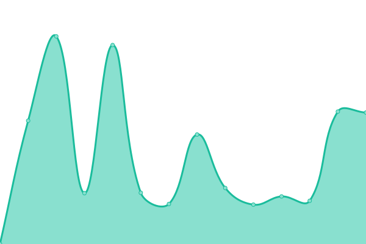
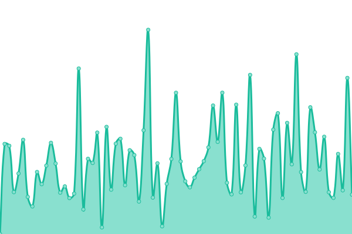

# [📈 Live Status](https://eftiarhossain279.github.io/mynyc): <!--live status--> **🟧 Partial outage**

This repository contains the open-source uptime monitor and status page for [eftiarhossain279](https://eftiarhossain279.github.io/mynyc), powered by [Upptime](https://github.com/upptime/upptime).

With [Upptime](https://upptime.js.org), you can get your own unlimited and free uptime monitor and status page, powered entirely by a GitHub repository. We use [Issues](https://github.com/eftiarhossain279/mynyc/issues) as incident reports, [Actions](https://github.com/eftiarhossain279/mynyc/actions) as uptime monitors, and [Pages](https://eftiarhossain279.github.io/mynyc) for the status page.

<!--start: status pages-->
<!-- This summary is generated by Upptime (https://github.com/upptime/upptime) -->
<!-- Do not edit this manually, your changes will be overwritten -->
<!-- prettier-ignore -->
| URL | Status | History | Response Time | Uptime |
| --- | ------ | ------- | ------------- | ------ |
|  [MY-Mikrotik-1](http://118.179.45.40:64000) | 🟥 Down | [my-mikrotik-1.yml](https://github.com/eftiarhossain279/mynyc/commits/HEAD/history/my-mikrotik-1.yml) | 

 0ms
     
 | 

<a href="https://eftiarhossain279.github.io/mynyc/history/my-mikrotik-1">0.00%</a>
    

|  [MY-Mikrotik-2](http://37.221.99.115:64000) | 🟥 Down | [my-mikrotik-2.yml](https://github.com/eftiarhossain279/mynyc/commits/HEAD/history/my-mikrotik-2.yml) | 

 0ms
     
 | 

<a href="https://eftiarhossain279.github.io/mynyc/history/my-mikrotik-2">0.00%</a>
    

|  [MY-Mikrotik-3](http://103.158.231.11:64000) | 🟩 Up | [my-mikrotik-3.yml](https://github.com/eftiarhossain279/mynyc/commits/HEAD/history/my-mikrotik-3.yml) | 

 758ms
     
 | 

<a href="https://eftiarhossain279.github.io/mynyc/history/my-mikrotik-3">99.07%</a>
    

|  [MY-Mikrotik-4](http://103.217.84.226:64000) | 🟥 Down | [my-mikrotik-4.yml](https://github.com/eftiarhossain279/mynyc/commits/HEAD/history/my-mikrotik-4.yml) | 

 0ms
     
 | 

<a href="https://eftiarhossain279.github.io/mynyc/history/my-mikrotik-4">0.00%</a>
    

|  [CDN-Mikrotik-1](http://118.179.45.40) | 🟩 Up | [cdn-mikrotik-1.yml](https://github.com/eftiarhossain279/mynyc/commits/HEAD/history/cdn-mikrotik-1.yml) | 

 768ms
     
 | 

<a href="https://eftiarhossain279.github.io/mynyc/history/cdn-mikrotik-1">100.00%</a>
    

|  [CDN-Mikrotik-2](http://118.179.50.70) | 🟥 Down | [cdn-mikrotik-2.yml](https://github.com/eftiarhossain279/mynyc/commits/HEAD/history/cdn-mikrotik-2.yml) | 

 1171ms
     
 | 

<a href="https://eftiarhossain279.github.io/mynyc/history/cdn-mikrotik-2">93.59%</a>
    

<!--end: status pages-->

[**Visit our status website →**](https://eftiarhossain279.github.io/mynyc)

## 📄 License

- Powered by: [Upptime](https://github.com/upptime/upptime)
- Code: [MIT](./LICENSE) © [Anand Chowdhary](https://anandchowdhary.com), supported by [Pabio](https://pabio.com)
- Data in the `./history` directory: [Open Database License](https://opendatacommons.org/licenses/odbl/1-0/)
